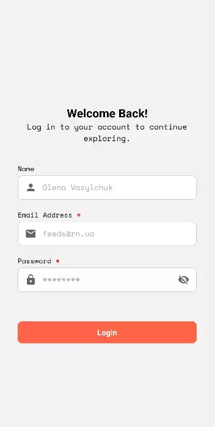

# Feedly Profile React Native App

Це мобільний додаток для відображення профілю користувача та стрічки фідів, реалізованим за допомогою **React Native** та **Expo**.

## Зміст

1. [Опис проекту](#опис-проекту)
2. [Інсталяція](#інсталяція)
3. [Сторінки додатку](#сторінки-додатку)
   - [Стрічка фідів](#стрічка-фідів)
   - [Профіль користувача](#профіль-користувача)
   - [Авторизація](#авторизація)
4. [Темна та світла тема](#темна-та-світла-тема)
5. [Ліцензія](#ліцензія)

## Опис проекту

Цей додаток включає дві основні сторінки:

- **Стрічка фідів (Feeds)**: Містить список зображень з автором.
- **Профіль користувача (Profile)**: Відображає основну інформацію користувача та дозволяє змінювати тему.

### Темна та світла тема:

- Додаток підтримує темну та світлу тему. Користувач може перемикатися між темами для кращого комфорту під час використання.

## Інсталяція

Щоб запустити проект локально, виконайте наступні кроки:

1. Клонування репозиторію:

   ```bash
   git clone https://github.com/Olena-P/feedly-profile.git
   ```

2. Встановлення залежностей:

   ```bash
   cd feedly-profile
   npm install
   ```

3. Запуск додатку в режимі розробки:

   ```bash
   npm start
   ```

4. Відкрийте додаток на вашому мобільному пристрої за допомогою Expo Go або в емулювальнику.

## Сторінки додатку

### Стрічка фідів

На цій сторінці відображається список фідів (зображень) з їхніми описами. Користувач може прокручувати стрічку і оновлювати контент.

 

**Особливості**:

- Підтримує оновлення через Pull-to-refresh.
- Завантаження додаткових елементів при прокручуванні в кінці списку.

### Профіль користувача

Ця сторінка містить інформацію про користувача, таку як ім'я та електронна адреса. Користувач може:


- Перемикати між темною та світлою темою.
- Вийти з облікового запису.

**Особливості**:

- Користувач може натискати на кнопки для зміни теми або виходу.

### Авторизація

Сторінка авторизації дозволяє користувачеві увійти в систему, використовуючи заготовлені логін і пароль. Для тестування використовуйте:



- Логін: `authfeedprofile@rn.ua`
- Пароль: `jg9385df`

## Темна та світла тема

В додатку підтримуються дві теми:

- **Світла тема**
- **Темна тема**

### Як змінити тему:

1. Користувач може перемикати тему через кнопку в профілі.
2. Тема автоматично зберігається для кожного сеансу користувача.


